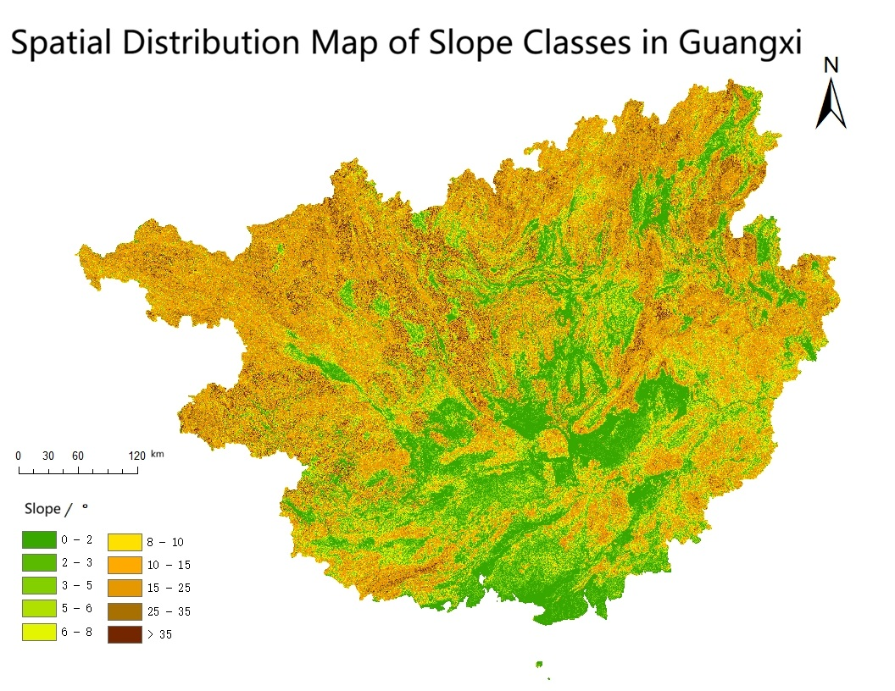
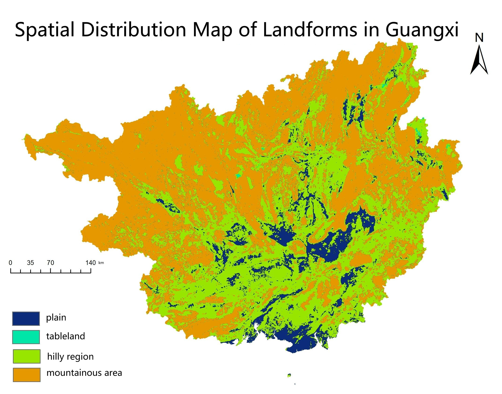

# Topography-Driven Modeling of Primary Industry Structure in Guangxi Using DEM and Neural Networks
This project explores the relationship between the diverse topography of Guangxi, China and the composition of its primary industry sectors (agriculture, forestry, animal husbandry, fishery and auxiliary services). Using digital elevation models (DEMs), geographic processing tools, economic static data, and machine‑learning techniques, our group of 4 analysed how geomorphologic factors such as slope, relief and landform type influence regional primary industry activity.
## Project Overview
**Objective**: Use DEM data to derive topographic and geomorphologic indicators for each municipality in Guangxi and investigate how those indicators affect the makeup of the primary industry through a machine‑learning model.\
\
**Scope**: The analysis covers all the prefectural‑level cities in Guangxi over the years 2013–2022. For each city, we calculated statistics such as the proportion of plains, hilly region, mountain area, and tableland, the average elevation, and a weighted slope value. These were paired with annual statistics on the value of agricultural, forestry, livestock, fishery, and service activities.\
\
**Motivation**: Topography affects soil development, climate and accessibility, which in turn shape agricultural suitability. Quantifying these relationships can help policymakers tailor development strategies to local conditions. We also aimed to practice applying machine‑learning methods to geographic data.
## Data Sources
**DEM**: 90 m resolution digital elevation model of Guangxi obtained from the Geospatial Data Cloud. The DEM data are projected in the CGCS2000/Gauss–Krüger Zone 19 coordinate system, following national mapping specifications. In order to get the DEM of Guangxi province, we downloaded four DEMs that contain parts of Guangxi, concatenation them, and in the end, they were clipped by city boundaries.

**Boundary Shapefile**: Municipal boundaries were used as masks to clip city‑level DEMs and derive elevation statistics. Guangxi and its prefectural-level cities' boundary shapefile data were downloaded from the Geospatial Data Cloud.

**Slope & Relief**: From the DEM we derived slope and relief. Relief was calculated in a 17 × 17 pixel (≈ 2.34 km²) window as the difference between the maximum and minimum elevations, following methods recommended for terrain analysis[1].

**Landform Classification**: We classified the above relief raster cell as plain, tableland, hill or mountain according to the national 1:1 million geomorphologic mapping standard. Cells with relief < 30 m and elevation < 200 m were labelled plain; relief < 30 m and elevation ≥ 200 m were tableland; relief between 30 m and 200 m were hill; and relief > 200 m were mountain. The area ratios of these landforms were computed for each city.
<p align="center">
  
  
</p>

**Slope‑Weighted Value**: Slope values were re‑classified into discrete bands based on the Technical specification for basic statistical analysis of national geographic conditions information[2]. Each band was assigned a weight proportional to the max value in its slope class.
 The slope‑weighted value of a city was the sum of each band’s area ratio multiplied by its weight.
•	Economic Data: Statistics on the value of agricultural, forestry, livestock, fishery and agricultural‑service activities for 2013–2022 were taken from the Guangxi Statistical Yearbook.
## Methods
###	Building the dataset
#### Feature construction
For each municipality and year, we assemble a single data row with seven input features (14 municipalities × 10 years, 2013–2022, yielding a total of 140 samples):

- Landform proportions: The shares of area classified as plain, tableland, hill and mountain. These four values sum to 1.

- Average elevation: The mean elevation (in metres) of the municipality.

- Slope‑weighted index: A weighted combination of slope classes; higher slopes contribute larger weights.

- Year: Encoded as an incremental numeric feature (2013 = 0.1, 2014 = 0.2, etc.).

Average elevation and the slope‑weighted index are standardised via z‑score. We do not normalise the landform proportions because their sum is already constrained to 1.

#### Targets
The label associated with each row is a five‑element vector containing the proportion of each primary industry sector—agriculture, forestry, animal husbandry, fishery and auxiliary services—within the municipality’s total primary industry output for that year.

###	Model design
To maintain interpretability, we fit a single linear layer (no hidden units) that maps the seven input features to the five output proportions. For example, the predicted share of agriculture is computed as

agriculture_share = w<sub>1</sub>·plain + w<sub>2</sub>·hill + w<sub>3</sub>·tableland + w<sub>4</sub>·mountain + w<sub>5</sub>·avg_elevation + w<sub>6</sub>·slope_index + w<sub>7</sub>·year + b

where w<sub>1</sub>…w<sub>7</sub> are the learned coefficients and b is a bias term. Positive weights indicate that increasing the corresponding feature tends to raise the predicted share of that sector, while negative weights indicate the opposite. In our interpretation we focus on the coefficients and ignore the bias.

 We adopted the AdamW optimiser with L2 regularization and a cosine‑annealing learning rate schedule, used mean‑squared error as the loss function and performed 10‑fold cross‑validation.
### Analysis
 After training, we examined the **learned weights to assess which factors contribute positively or negatively to each industry**. During experimentation, we observed that the trained model weights varied significantly across different training runs.
## Limitations and Future Work
### Multicollinearity in Inputs and Targets

Both the input landform features and the target sector outputs are compositional data:

- The four landform proportions sum to 1.

- The five industry output proportions also sum to 1.

This introduces perfect linear dependence among variables, leading to multicollinearity. As a result, the model coefficients become highly sensitive to small changes in the data, causing unstable weight estimates.

#### Possible Improvements

- Compositional data transformations: As we don't want to remove one component from each compositional group. We can apply compositional data transformations (e.g., log-ratio transformation).

### Small Sample Size vs. Model Complexity

The dataset contains 140 observations, while the model has 35 weights + 5 biases (40 parameters total).

The ratio of data points to model parameters is relatively low, which increases estimation variance and reduces model stability.
#### Possible Improvements
- Increase the dataset size (e.g., include more years).
- Reduce model complexity (e.g., remove the year feature).
## Repo Structure

```text
├── Chinese_documents/        # Chinese Supplementary documentation
├── maps/       # Two English-translated maps
├── models/                   
│   ├── HW_Natural_Resources.ipynb  # Model construction and training
│   ├── input_data.csv       # Processed dataset
│   └── model.ckpt      # Final checkpoint
└── README.md           
```
## Acknowledgment

The training code is adapted from:
Heng-Jui Chang (NTUEE) – ML2021 Spring HW01  
https://github.com/ga642381/ML2021-Spring/blob/main/HW01/HW01.ipynb

The code has been modified for this project.
## Group Contributions
This project was completed by a team of four students as part of a Natural Resource Monitoring course. The responsibilities were roughly divided as follows:
-	Data Acquisition and Preprocessing(my role): Clipping DEMs to municipal boundaries, computing slope, relief and landform classes.

-	Geomorphologic Analysis(my role): Implementing the terrain classification and calculating surface area and slope‑weighted values.

-	Economic Data Compilation: Gathering and cleaning economic statistics from the Guangxi Statistical Yearbook.

-	Machine‑Learning Analysis (my role): Designing the feature engineering pipeline, training the neural network and interpreting the influence of topography on the primary industry sectors.


## Reference
[1] Multicollinearity and Regularization in Regression Models | by Dilip Kumar | Medium
https://dilipkumar.medium.com/multicollinearity-and-regularization-in-regression-models-25c24b9107a7\
https://statisticsbyjim.com/regression/multicollinearity-in-regression-analysis/

[2] Technical specification for basic statistical analysis of national geographic conditions information
https://ghzrzyw.beijing.gov.cn/biaozhunguanli/bztg/201912/P020191213659390586371.pdf